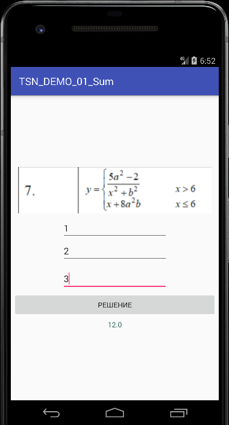

# Android_Lab1
Лабораторная работа 1



```
if (x>6){
                y = (5*Math.pow(a,2)-2)/(Math.pow(x,2)+Math.pow(b,2));
            }
            else {
                y = x+8+Math.pow(a,2)*b;
            }
